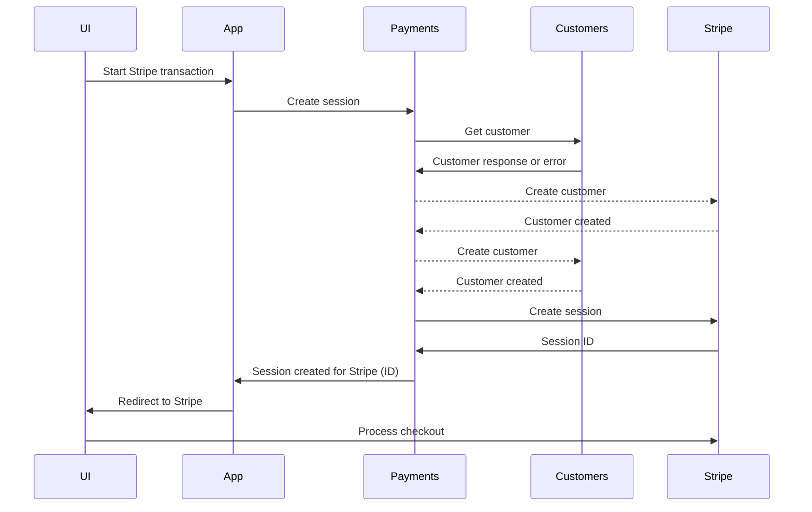

The payments service is in charge of processing payment processor events (e.g. Stripe) and updating user balances inside of the Ignition Robotics billing system.

## Workflow

```mermaid
sequenceDiagram
    UI->>App: Start Stripe transaction
    App->>Payments: Create session
    Payments->>Customers: Get customer
    Customers->>Payments: Customer response or error
    Payments-->>Stripe: Create customer
    Stripe-->>Payments: Customer created
    Payments-->>Customers: Create customer
    Customers-->>Payments: Customer created
    Payments->>Stripe: Create session
    Stripe->>Payments: Session ID
    Payments->>App: Session created for Stripe (ID)
    App->>UI: Redirect to Stripe
    UI->>Stripe: Process checkout
```
